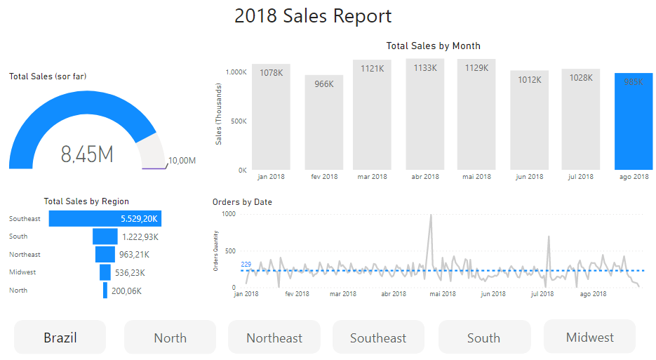

# Data Analysis 
### Business Questions.

_We want answers!_ 

**The company's business areas have some questions and challenges such as:**

- Can we give the same benefits to all shopkeepers (sellers)? Or is there one that deserves to be highlighted?

- Is there a difference in the amount of freight charged in different regions, cities? Or can we apply the shipping subsidy rules to any location?

- Is our product catalog comprehensive? Or does it focus on specific categories?

- Do we always sell the same products? Or are there seasonalities?

**Dashboard that analyzes the company's latest sales data that can be shared with Regional leads and their respective analysts:**

- Total Sales
- Sales per Region
- Top 5 selling categories for each Region

_delivered orders only_

## Results

### Dashboard

 

### Business Questions

- **Can we give the same benefits to all shopkeepers (sellers)? Or is there one that deserves to be highlighted?**

One form of evaluation is to give benefits based on productivity, using RFV (Recency, Frequency and Value) 
as main metrics.

So... Yes, **there are sellers who deserve to be highlighted:**

- **Super Productive:** High Value High Frequency! Top 10% of sales and frequency. 
- **Productive:** lots of sales, high revenue. 
- **High Value:** few sales, but great revenue values.
- **High Frequency:** low revenue value, but many sales.
- **Low Value Low Frequency:** low revenue value and few sales.

[**Web App Visual Approach.**](https://share.streamlit.io/pauloreis-ds/olist_streamlit_rfv_seller_segmentation/main/main.py)

        ps: Inactive Sellers (sellers more than 10 months with no sales)
            New Sellers (sellers who have been in the database for a maximum of 2 months)

- Is there a difference in the amount of freight charged in different regions, cities? Or can we apply the shipping subsidy rules to any location?**

Yes, there is a difference among cities and regions.

