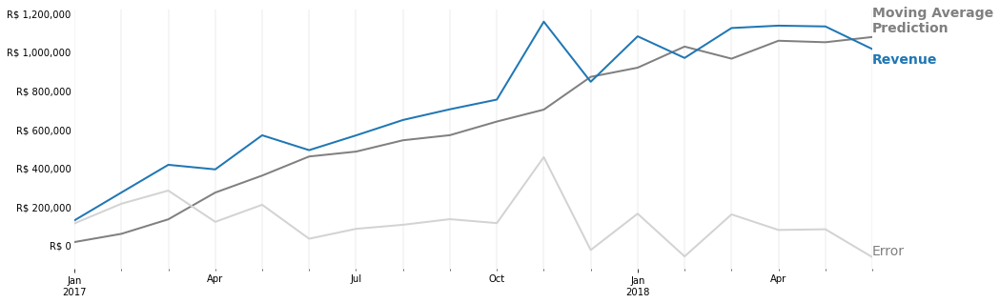
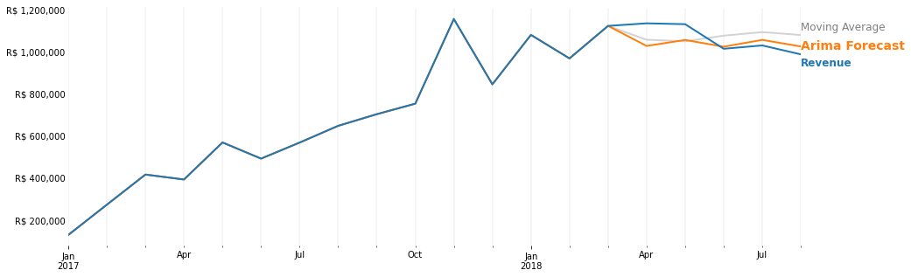
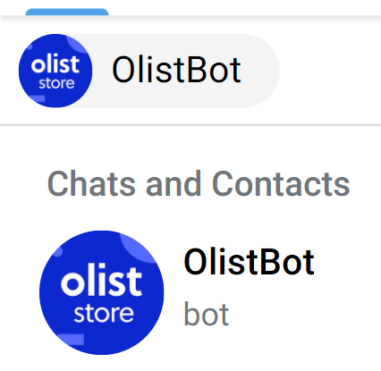

## Sales Forecast

**Motivation! What's the context?**
- In 2017 Olist started to forecast its monthly sales based on the average revenue from 3 months before. 
  But now the company wants to be able to predict future sales more accurately with a wider time range (3 months).

**Why?**
- To efficiently allocate resources for future projects, growth and manage its cash flow. 

**Who are the stakeholders?**
- The financial sector will use the forecast to the set operating budgets and to project cash flows.
- And the marketing team, who will have the opportunity to schedule promotions if it appears sales  
will be weak and will be able to better allocate budget among other marketing activities.

**What is the deliverable?**
- A dashboard with the information about the forecast.
> got [Telegram Bot](#Telegram-Bot) instead

 

> **ps: We will use the data to forecast the second quarter of 2018 and the third quarter will be our "production data".**

## Result
[Arima Notebook.](https://nbviewer.jupyter.org/github/pauloreis-ds/olist/blob/main/sales_prediction/notebooks/1.4-pr-sales-prediction-arima.ipynb)

In the beginning of this project, Olist moving average predictive model has been showing large errors,
even though it was getting lower. And for next Quarter, <strong>Olist needs a model with an error lower than 6.75%
(current moving average error of about R$ 73,935.56).</strong>

 

    

<strong> The Project was successful</strong>, since We deacrease the error when predicting the sales from second quarter of 2018.
Now, Olist can forecast the 3rd quarter expecting an error of 5.7% (R$ 64,127.08) above or below the real revenue value, 
instead of 6.7% (R$ 73,935.56). <strong>And after two months of trial the arima model has been showing to be a more accurate model. During this
trial Arima has shown an actual error of 3.18% (R$ 31,915.91) whereas if Olist had continued to rely on the old moving average it would have to deal
with an error equals to 7.74% (R$ 77,616.39).</strong>

 

    

**So, now, Olist is able to forecast 3 months ahead instead of 1 and more accurately than it has been doing.**

### Telegram Bot

As an extra task I decided to create this bot. 
You can found it on telegram searching for ["OlistBot"](https://web.telegram.org/z/#1862189868) or "@olist_telegram_bot". 
Then, you just have to write the region (e.g north) you want to know the forecast.

    

> The app might be sleeping, so it can take a while for heroku to restart it.

**Code:** 
[Model API Deployment](https://github.com/pauloreis-ds/olist_regional_sales_forecast_app)  
[Telegram Bot](https://github.com/pauloreis-ds/olist-telegram-bot)  

I also used **docker** to build and run the application. [Check the video](https://youtu.be/sad52pli_a0).